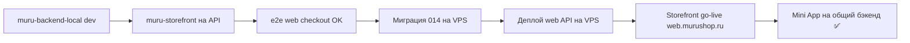

# MURU — Deploy Runbook

Операционный чеклист деплоя. Детали API — в [`API_CONTRACT.md`](API_CONTRACT.md). Статус работ — в [`PROGRESS.md`](PROGRESS.md).

**Версия:** 2026-07-06 (после cutover прода на канон, см. `PROGRESS.md` → «Унификация бэкендов» U1-U4)

---

## 1. Карта окружений

| Компонент | Репозиторий | GitHub | Где крутится |
|---|---|---|---|
| Mini App + API (прод) | **`muru-backend-local`** (канон) | `VasiliiLbyte/muru-backend-local`, ветка `master` | Beget VPS `/var/www/muru`, PM2 `muru-backend` (:4000) |
| Staging backend (тест перед прод-изменениями) | `muru-backend-local`, ветка `master` (или feature-ветка) | тот же репозиторий | Beget VPS `/var/www/muru-staging`, PM2 `muru-backend-staging` (:4001), домен `api-staging.murushop.ru` |
| ~~MURU_miniAPP~~ | Заморожен с 2026-07-06 | `VasiliiLbyte/MURU_miniAPP` | Не деплоится, история сохранена для референса |
| Витрина (staging → будущий muru.ru) | `muru-storefront` | `VasiliiLbyte/muru-storefront` | Beget VPS `/var/www/muru-storefront`, PM2 `muru-storefront`; локально `:3000` |
| Документация / оркестратор | `muru-docs` | `VasiliiLbyte/muru-docs` | Git only |

**Домены (прод сегодня):**

| Домен | Назначение |
|---|---|
| `murushop.ru` | Mini App + API (canonical), включая `/yookassa-webhook` |
| `murushop.online` | Легаси-домен — **301 редирект на `murushop.ru`** для всех путей (см. `deploy/nginx-murushop.online.conf`). ЮKassa webhook настроен на `murushop.ru`, не `.online` |
| `api-staging.murushop.ru` | Staging backend (порт 4001), только API, без frontend mini app |
| `web.murushop.ru` | Staging витрина (Next.js, `muru-storefront`) |
| `muru.ru` | Bitrix (выводится) → заменит `muru-storefront` |

---

## 2. VPS: Mini App + Backend (текущий прод)

### Предусловия

- Ubuntu 22.04, PM2, nginx, Let's Encrypt
- PostgreSQL (локально или managed)
- Путь приложения: `/var/www/muru`
- PM2 process: `muru-backend`, порт **4000**

### Чеклист перед деплоем

- [ ] Изменения протестированы локально (`tsc`, vitest, ручной e2e)
- [ ] Для рискованных изменений — обкатано на staging (`api-staging.murushop.ru`, см. §2a) перед прод-деплоем
- [ ] Миграции БД подготовлены (см. §4)
- [ ] `.env` на VPS обновлён (новые ключи)
- [ ] Nginx конфиг актуален (`deploy/nginx-murushop.ru.conf`)

> С 2026-07-06 (cutover, `PROGRESS.md` DEP-008) прод `/var/www/muru` деплоится **напрямую из канона** `muru-backend-local` (`origin` на VPS переключён). Форвард-порт в `MURU_miniAPP` (заморожен) больше не нужен — см. `FORWARD_PORT.md` (deprecated).

### Команды деплоя

```bash
cd /var/www/muru
git pull origin master

# Полный деплой (backend + frontend mini app)
bash deploy.sh
```

Или вручную (из `README.md`):

```bash
cd /var/www/muru/backend
npm ci
NODE_OPTIONS=--max-old-space-size=2048 npm run build
npm ci --omit=dev

cd ../frontend
npm install
npm run build

cd ..
pm2 reload ecosystem.config.js --update-env
pm2 save
```

Nginx (при изменении конфигов):

```bash
sudo bash deploy/sync-nginx-murushop.sh
sudo nginx -t && sudo systemctl reload nginx
```

### Проверка после деплоя

```bash
pm2 status
pm2 logs --lines 100
curl -sS http://127.0.0.1:4000/api/health
curl -sS -o /dev/null -w "%{http_code}" https://murushop.ru/catalog
curl -X POST https://murushop.ru/yookassa-webhook   # curl с не-ЮKassa IP → 404 (ожидаемо, см. ниже), НЕ 500/405
```

> **Про `/yookassa-webhook` и 404:** при `YOOKASSA_VERIFY_IP=true` (прод-default) `yookassaIpGuard` сознательно отдаёт пустой `404` (не 403) любому IP вне официального allowlist ЮKassa — это защита, а не баг. `curl` с произвольного IP (в т.ч. с самого VPS через `localhost:4000`) получит 404 — это ожидаемо и подтверждает, что guard работает. Значимая проверка вебхука — только через реальный платёж или временный `YOOKASSA_VERIFY_IP=false` на **staging** (не на проде). `murushop.online/yookassa-webhook` всегда отдаёт `301` на `murushop.ru` (легаси-домен, см. §1) — это не ошибка.

**Ручной smoke:**
- Mini App открывается из Telegram
- Каталог, корзина, checkout (native invoice)
- Админ: sync, заказы
- `/api/admin/me` только для `ADMIN_TELEGRAM_IDS`

### Image cache

```bash
mkdir -p /var/www/muru/cache/img
# IMAGE_CACHE_DIR=/var/www/muru/cache/img в .env
```

---

## 2a. VPS: Staging backend (для рискованных изменений)

**URL:** `https://api-staging.murushop.ru` (API only, без frontend mini app)
**Путь на VPS:** `/var/www/muru-staging`
**PM2:** `muru-backend-staging`, порт **4001**, отдельный процесс от прод `muru-backend`

### Жёсткие правила (не нарушать)
- `TELEGRAM_BOT_TOKEN` в staging `.env` — **всегда пусто**. Два поллера на один токен = `409 Conflict` и падение прод-бота.
- Деплой ТОЛЬКО через `bash deploy-staging.sh` (никогда `pm2 reload ecosystem.config.js` — это имя прод-процесса).
- ЮKassa webhook остаётся направлен на прод; на staging платёжные статусы — только поллингом.
- При `NODE_ENV=production` (staging использует его для реалистичности) обязательны непустые `YOOKASSA_SHOP_ID`/`YOOKASSA_SECRET_KEY`/`YOOKASSA_RETURN_URL` — иначе `env.ts` завершает процесс на старте (`process.exit(1)`, лог может не успеть сброситься — выглядит как «тихий краш»). Достаточно любых непустых значений, реальный вызов ЮKassa на staging не требуется для базового смоука.
- CDEK-эндпоинты без реальных `CDEK_CLIENT_ID/SECRET` вернут `500` — это ожидаемо (не guard на старте, падает в рантайме), не блокирует остальной смоук.

### Первичный сетап (одноразово)
```bash
sudo -u postgres createdb -O muru_user muru_staging
sudo -u postgres psql -d muru_staging -c "ALTER SCHEMA public OWNER TO muru_user;"  # PG15+: обязательно, иначе permission denied при restore
PGPASSWORD='<пароль>' pg_dump -h localhost -U muru_user -d muru_db | PGPASSWORD='<пароль>' psql -h localhost -U muru_user -d muru_staging

cd /var/www
git clone -b master https://github.com/VasiliiLbyte/muru-backend-local.git muru-staging   # ВАЖНО: -b master — дефолтная ветка на GitHub сейчас main (устаревшая)
cd muru-staging
cp .env.staging.example .env
# отредактировать: PORT=4001, DATABASE_URL → muru_staging, TELEGRAM_BOT_TOKEN пусто, JWT_SECRET новый, YOOKASSA_* непустые плейсхолдеры (см. выше)
bash deploy-staging.sh
```

Nginx (одноразово, домен нужно предварительно завести A-записью в DNS):
```bash
sudo cp deploy/nginx-api-staging.conf /etc/nginx/sites-available/api-staging.murushop.ru
sudo ln -sf /etc/nginx/sites-available/api-staging.murushop.ru /etc/nginx/sites-enabled/
sudo certbot --nginx -d api-staging.murushop.ru
sudo nginx -t && sudo systemctl reload nginx
```

### Обновление staging (после первичного сетапа)
```bash
cd /var/www/muru-staging
git pull origin master   # или нужная feature-ветка
bash deploy-staging.sh
pm2 status   # muru-backend (прод) restart-counter НЕ должен меняться
```

### Проверка
```bash
curl -sS -o /dev/null -w "%{http_code}\n" https://api-staging.murushop.ru/api/health
pm2 status   # muru-backend-staging online; muru-backend (прод) без изменений
```

---

## 3. Ожидающий деплой (живой статус)

**Источник правды:** [`PROGRESS.md`](PROGRESS.md) → секция **«Ожидает деплоя (Pending deploy)»**.

Таблица `DEP-xxx` отслеживает: код verified в git, но ещё не на VPS / не в prod-БД. Команды деплоя — в §2 ниже; протокол синхронизации репо — [`FORWARD_PORT.md`](FORWARD_PORT.md).

После успешного деплоя Василий сообщает оркестратору → строка помечается `deployed`, переносится в «Сделано» в PROGRESS.

---

## 4. Миграции БД

Применять к **той же** БД, что в `DATABASE_URL` на целевом сервере.

```bash
# Базовая схема (идемпотентно)
psql "$DATABASE_URL" -f backend/src/db/schema.sql

# По порядку 001–015 (если ещё не применены)
psql "$DATABASE_URL" -f backend/src/db/migrations/014_web_identity.sql
psql "$DATABASE_URL" -f backend/src/db/migrations/015_web_catalog_placements.sql
```

**014 — web-канал:**
- `orders.telegram_user_id`, `payments.telegram_user_id` → nullable
- `channel TEXT NOT NULL DEFAULT 'telegram'` CHECK `IN ('telegram','web')`

Проверка:

```sql
SELECT column_name, is_nullable FROM information_schema.columns
WHERE table_name = 'orders' AND column_name IN ('telegram_user_id', 'channel');
```

---

## 5. Ключевые env на VPS (backend)

Обязательные группы (полный список: `muru-backend-local/.env.example`):

| Группа | Переменные |
|---|---|
| Core | `DATABASE_URL`, `JWT_SECRET`, `PORT=4000`, `NODE_ENV=production` |
| Telegram | `TELEGRAM_BOT_TOKEN`, `TELEGRAM_MINI_APP_URL`, `ADMIN_TELEGRAM_IDS` |
| Google sync | `GOOGLE_*`, `CATALOG_SOURCE=xlsx`, `GOOGLE_CATALOG_FILE_ID`, `GOOGLE_DRIVE_FOLDER_ID` |
| CDEK | `CDEK_ENV=production`, `CDEK_CLIENT_ID`, `CDEK_CLIENT_SECRET`, sender fields |
| YooKassa | `YOOKASSA_SHOP_ID`, `YOOKASSA_SECRET_KEY`, `YOOKASSA_RETURN_URL`, `YOOKASSA_VAT_CODE` |
| Web (при cutover) | `YOOKASSA_WEB_RETURN_URL`, `YOOKASSA_WEB_SHOP_ID`, `YOOKASSA_WEB_SECRET_KEY`, `ALLOWED_ORIGINS` |
| DaData | `DADATA_API_KEY` |
| Images | `IMAGE_CACHE_DIR` |

После смены `.env`:

```bash
pm2 reload ecosystem.config.js --update-env
```

---

## 6. Storefront (staging + будущий muru.ru)

### Staging (live)

**URL:** `https://web.murushop.ru`  
**Путь на VPS:** `/var/www/muru-storefront`  
**PM2:** `muru-storefront`

```bash
cd /var/www/muru-storefront
git pull origin main
# На VPS часто NODE_ENV=production → npm ci без флага не ставит devDependencies
# (@tailwindcss/postcss, msw нужны на этапе build). Всегда --include=dev до сборки.
npm ci --include=dev
NODE_OPTIONS=--max-old-space-size=2048 npm run build
# Только после успешного build — можно урезать node_modules для runtime
npm ci --omit=dev
pm2 restart muru-storefront
pm2 save
```

> **Recovery после failed build (502):** не делать `pm2 restart` и `npm ci --omit=dev`, пока `npm run build` не прошёл. `rm -rf .next node_modules && npm ci --include=dev && npm run build`, затем restart.

> Бэкенд на VPS должен быть жив на время `npm run build` — `sitemap.xml` ходит в API. Меню каталога (`catalog-menu`) при недоступном API деградирует мягко (DEP-007).

### Локальная разработка

```bash
cd muru-storefront
npm install
# .env.local — см. API_CONTRACT.md §6
npm run dev   # :3000
```

### Прод (TBD — решение до go-live)

Варианты из ТЗ: Vercel vs Beget VPS (latency РФ, 152-ФЗ).

**Минимум перед go-live на `muru.ru`:**
- [x] Гидрация корзины на реальный API — закрыто 2026-07-02
- [ ] `NEXT_PUBLIC_API_BASE` → прод API URL
- [ ] `NEXT_PUBLIC_CATALOG_API_BASE` → тот же API
- [ ] `NEXT_PUBLIC_API_MOCKING` **выключен**
- [ ] Домен витрины в `ALLOWED_ORIGINS` бэкенда
- [ ] `YOOKASSA_WEB_RETURN_URL` → `https://muru.ru/checkout/return/`
- [ ] CSP / security headers (Prompt 15 ТЗ)
- [ ] 301-редиректы с Bitrix URL

---

## 7. YooKassa webhook

| Окружение | URL |
|---|---|
| Прод | `https://murushop.ru/yookassa-webhook` |
| ~~`murushop.online/yookassa-webhook`~~ | Устарело — `.online` теперь **301 на `.ru`** целиком (легаси-домен, см. §1). В личном кабинете ЮKassa должен быть указан `murushop.ru`, не `.online` |

События: `payment.succeeded`, `payment.canceled`
При втором магазине (web) — тот же webhook URL в личном кабинете ЮKassa.

**Проверка через `curl` с произвольного IP → `404`, это ожидаемо** (см. §2a про `yookassaIpGuard` + `YOOKASSA_VERIFY_IP=true`). `500`/`405`/зависание — реальная проблема, `404` от VPS/локального curl — нет. Полноценная проверка — только реальным платежом (ЮKassa шлёт вебхук со своих официальных IP) или временным `YOOKASSA_VERIFY_IP=false` на staging.

---

## 8. Strangler: порядок cutover (✅ завершён 2026-07-06)



Последний шаг (G) выполнен: `/var/www/muru` теперь деплоится напрямую из `muru-backend-local` (`master`), `MURU_miniAPP` заморожен. Детали — `PROGRESS.md` → «Унификация бэкендов» U1-U4, `DEP-008`.

**Отдельно от strangler (2026-07-06): унификация двух репозиториев backend'а** (`muru-backend-local` ↔ `MURU_miniAPP`) в единый канон — см. `PROGRESS.md` разделы U1 (аудит дрейфа) → U4 (cutover). Не путать с strangler-паттерном выше (тот про API для storefront, этот — про сам репозиторий).

---

## 9. Частые проблемы

| Симптом | Решение |
|---|---|
| `tsc: not found` на VPS | `npm ci` → build → `npm ci --omit=dev` (не наоборот) |
| OOM при backend build | `NODE_OPTIONS=--max-old-space-size=2048` |
| CDEK расчёт пустой | Проверить `CDEK_CLIENT_ID/SECRET` в `.env` **первым делом** |
| Витрина на MSW вместо бэка | Задать `NEXT_PUBLIC_API_BASE` |
| CORS blocked | Добавить origin в `ALLOWED_ORIGINS` |
| Sync timeout в админке | nginx `proxy_read_timeout 300s` для `/api/` |
| Webhook 405 | `sudo bash deploy/sync-nginx-murushop.sh` |
| Webhook 404 через curl | Ожидаемо — `yookassaIpGuard` блокирует не-ЮKassa IP, см. §7. Не чинить |
| Staging-процесс «тихо» падает сразу после старта (`errored`, лог только dotenv-tips) | При `NODE_ENV=production` проверить непустые `YOOKASSA_SHOP_ID/SECRET_KEY/RETURN_URL` в `.env` — `env.ts` делает `process.exit(1)` без гарантированного флаша лога |
| `git clone` даёт старый код без ожидаемых файлов | Проверить дефолтную ветку на GitHub (`git ls-remote --symref <url> HEAD`) — у `muru-backend-local` дефолт `main` (устаревший), канон — `master`. Всегда клонировать `-b master` |
| `pg_dump \| psql` в новую БД → `permission denied for schema public` | PG15+: `ALTER SCHEMA public OWNER TO <user>;` перед restore — владелец БД не наследует владение автосозданной схемой |

---

## 10. Ответственность

| Действие | Кто |
|---|---|
| `git pull` + `deploy.sh` на VPS | Василий |
| Миграции на прод-БД | Василий |
| Env / webhook / nginx на Beget | Василий |
| Код, промпты, verify, PROGRESS | Оркестратор + исполнители в Plan mode |

---

## Changelog

| Дата | Изменение |
|---|---|
| 2026-07-02 | Первая версия runbook |
| 2026-07-02 | `muru-backend-local` remote → отдельный GitHub-репо |
| 2026-07-06 | Cutover прода на канон (`DEP-008`): карта окружений, §2a staging backend, YooKassa webhook §7 (домен `.ru`, IP-guard 404), частые проблемы дополнены находками U3/U4 |
| 2026-07-02 | Pending deploy — живой статус в PROGRESS.md |
| 2026-07-04 | DEP-006/007 deployed; staging storefront в карте окружений |
