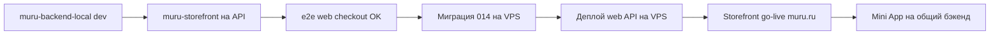

# MURU — Deploy Runbook

Операционный чеклист деплоя. Детали API — в [`API_CONTRACT.md`](API_CONTRACT.md). Статус работ — в [`PROGRESS.md`](PROGRESS.md).

**Версия:** 2026-07-02

---

## 1. Карта окружений

| Компонент | Репозиторий | GitHub | Где крутится |
|---|---|---|---|
| Mini App + API (прод) | `MURU_miniAPP` | `VasiliiLbyte/MURU_miniAPP` | Beget VPS `/var/www/muru` |
| Канонический бэкенд (dev) | `muru-backend-local` | `VasiliiLbyte/muru-backend-local` | Локально `:4000`, ветка `storefront-integration` |
| Витрина (dev → будущий muru.ru) | `muru-storefront` | `VasiliiLbyte/muru-storefront` | Локально `:3000`, хостинг TBD |
| Документация / оркестратор | `muru-docs` | `VasiliiLbyte/muru-docs` | Git only |

**Домены (прод сегодня):**

| Домен | Назначение |
|---|---|
| `murushop.ru` | Mini App + API (canonical) |
| `murushop.online` | Редирект / YooKassa test webhook |
| `muru.ru` | Bitrix (выводится) → заменит `muru-storefront` |

---

## 2. VPS: Mini App + Backend (текущий прод)

### Предусловия

- Ubuntu 22.04, PM2, nginx, Let's Encrypt
- PostgreSQL (локально или managed)
- Путь приложения: `/var/www/muru`
- PM2 process: `muru-backend`, порт **4000**

### Чеклист перед деплоем

- [ ] Изменения протестированы локально (`tsc`, vitest, ручной e2e)
- [ ] Форвард-порт из `muru-backend-local` → `MURU_miniAPP` выполнен (если фича новая)
- [ ] Миграции БД подготовлены (см. §4)
- [ ] `.env` на VPS обновлён (новые ключи)
- [ ] Nginx конфиг актуален (`deploy/nginx-murushop.ru.conf`)

### Команды деплоя

```bash
cd /var/www/muru
git pull origin master

# Полный деплой (backend + frontend mini app)
bash deploy.sh
```

Или вручную (из `README.md`):

```bash
cd /var/www/muru/backend
npm ci
NODE_OPTIONS=--max-old-space-size=2048 npm run build
npm ci --omit=dev

cd ../frontend
npm install
npm run build

cd ..
pm2 reload ecosystem.config.js --update-env
pm2 save
```

Nginx (при изменении конфигов):

```bash
sudo bash deploy/sync-nginx-murushop.sh
sudo nginx -t && sudo systemctl reload nginx
```

### Проверка после деплоя

```bash
pm2 status
pm2 logs --lines 100
curl -sS http://127.0.0.1:4000/api/health
curl -sS -o /dev/null -w "%{http_code}" https://murushop.ru/catalog
curl -X POST https://murushop.online/yookassa-webhook   # ожидается 200, не 405
```

**Ручной smoke:**
- Mini App открывается из Telegram
- Каталог, корзина, checkout (native invoice)
- Админ: sync, заказы
- `/api/admin/me` только для `ADMIN_TELEGRAM_IDS`

### Image cache

```bash
mkdir -p /var/www/muru/cache/img
# IMAGE_CACHE_DIR=/var/www/muru/cache/img в .env
```

---

## 3. Ожидающий деплой (живой статус)

**Источник правды:** [`PROGRESS.md`](PROGRESS.md) → секция **«Ожидает деплоя (Pending deploy)»**.

Таблица `DEP-xxx` отслеживает: код verified в git, но ещё не на VPS / не в prod-БД. Команды деплоя — в §2 ниже; протокол синхронизации репо — [`FORWARD_PORT.md`](FORWARD_PORT.md).

После успешного деплоя Василий сообщает оркестратору → строка помечается `deployed`, переносится в «Сделано» в PROGRESS.

### Текущие pending (на 2026-07-02)

См. актуальную таблицу в PROGRESS. На момент написания:

| ID | Кратко |
|---|---|
| DEP-001 | Удаление `POST /orders/create` — код в `MURU_miniAPP`, VPS pending |
| DEP-002 | Миграция `014_web_identity.sql` — local OK, VPS DB pending |
| DEP-003 | Web checkout API — только local, не на VPS до cutover |

---

## 4. Миграции БД

Применять к **той же** БД, что в `DATABASE_URL` на целевом сервере.

```bash
# Базовая схема (идемпотентно)
psql "$DATABASE_URL" -f backend/src/db/schema.sql

# По порядку 001–014 (если ещё не применены)
psql "$DATABASE_URL" -f backend/src/db/migrations/014_web_identity.sql
```

**014 — web-канал:**
- `orders.telegram_user_id`, `payments.telegram_user_id` → nullable
- `channel TEXT NOT NULL DEFAULT 'telegram'` CHECK `IN ('telegram','web')`

Проверка:

```sql
SELECT column_name, is_nullable FROM information_schema.columns
WHERE table_name = 'orders' AND column_name IN ('telegram_user_id', 'channel');
```

---

## 5. Ключевые env на VPS (backend)

Обязательные группы (полный список: `muru-backend-local/.env.example`):

| Группа | Переменные |
|---|---|
| Core | `DATABASE_URL`, `JWT_SECRET`, `PORT=4000`, `NODE_ENV=production` |
| Telegram | `TELEGRAM_BOT_TOKEN`, `TELEGRAM_MINI_APP_URL`, `ADMIN_TELEGRAM_IDS` |
| Google sync | `GOOGLE_*`, `CATALOG_SOURCE=xlsx`, `GOOGLE_CATALOG_FILE_ID`, `GOOGLE_DRIVE_FOLDER_ID` |
| CDEK | `CDEK_ENV=production`, `CDEK_CLIENT_ID`, `CDEK_CLIENT_SECRET`, sender fields |
| YooKassa | `YOOKASSA_SHOP_ID`, `YOOKASSA_SECRET_KEY`, `YOOKASSA_RETURN_URL`, `YOOKASSA_VAT_CODE` |
| Web (при cutover) | `YOOKASSA_WEB_RETURN_URL`, `YOOKASSA_WEB_SHOP_ID`, `YOOKASSA_WEB_SECRET_KEY`, `ALLOWED_ORIGINS` |
| DaData | `DADATA_API_KEY` |
| Images | `IMAGE_CACHE_DIR` |

После смены `.env`:

```bash
pm2 reload ecosystem.config.js --update-env
```

---

## 6. Storefront (будущий muru.ru)

### Локальная разработка

```bash
cd muru-storefront
npm install
# .env.local — см. API_CONTRACT.md §6
npm run dev   # :3000
```

### Прод (TBD — решение до go-live)

Варианты из ТЗ: Vercel vs Beget VPS (latency РФ, 152-ФЗ).

**Минимум перед go-live:**
- [ ] Гидрация корзины на реальный API (блокер)
- [ ] `NEXT_PUBLIC_API_BASE` → прод API URL
- [ ] `NEXT_PUBLIC_CATALOG_API_BASE` → тот же API
- [ ] `NEXT_PUBLIC_API_MOCKING` **выключен**
- [ ] Домен витрины в `ALLOWED_ORIGINS` бэкенда
- [ ] `YOOKASSA_WEB_RETURN_URL` → `https://muru.ru/checkout/return/`
- [ ] CSP / security headers (Prompt 15 ТЗ)
- [ ] 301-редиректы с Bitrix URL

---

## 7. YooKassa webhook

| Окружение | URL |
|---|---|
| Тест | `https://murushop.online/yookassa-webhook` |
| Прод | тот же endpoint (nginx на `.online` и `.ru`) |

События: `payment.succeeded`, `payment.canceled`  
При втором магазине (web) — тот же webhook URL в личном кабинете ЮKassa.

Проверка: `curl -X POST https://murushop.online/yookassa-webhook` → **200**

---

## 8. Strangler: порядок cutover



Не деплоить web-канал на прод до:
1. Гидрации корзины
2. E2E на staging/preview
3. Миграции 014

---

## 9. Частые проблемы

| Симптом | Решение |
|---|---|
| `tsc: not found` на VPS | `npm ci` → build → `npm ci --omit=dev` (не наоборот) |
| OOM при backend build | `NODE_OPTIONS=--max-old-space-size=2048` |
| CDEK расчёт пустой | Проверить `CDEK_CLIENT_ID/SECRET` в `.env` **первым делом** |
| Витрина на MSW вместо бэка | Задать `NEXT_PUBLIC_API_BASE` |
| CORS blocked | Добавить origin в `ALLOWED_ORIGINS` |
| Sync timeout в админке | nginx `proxy_read_timeout 300s` для `/api/` |
| Webhook 405 | `sudo bash deploy/sync-nginx-murushop.sh` |

---

## 10. Ответственность

| Действие | Кто |
|---|---|
| `git pull` + `deploy.sh` на VPS | Василий |
| Миграции на прод-БД | Василий |
| Env / webhook / nginx на Beget | Василий |
| Код, промпты, verify, PROGRESS | Оркестратор + исполнители в Plan mode |

---

## Changelog

| Дата | Изменение |
|---|---|
| 2026-07-02 | Первая версия runbook |
| 2026-07-02 | `muru-backend-local` remote → отдельный GitHub-репо |
| 2026-07-02 | Pending deploy — живой статус в PROGRESS.md |
