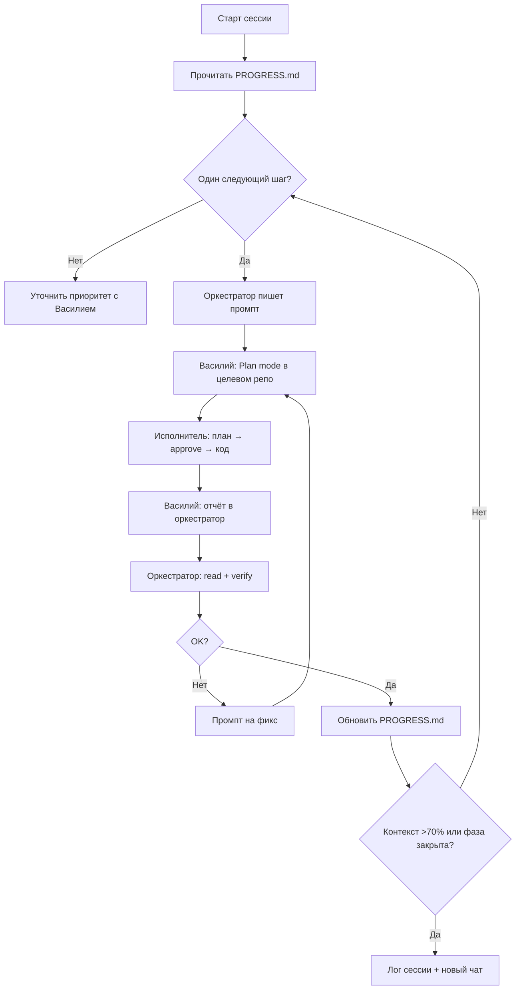

# MURU — Playbook оркестратора

Руководство для чата-оркестратора (`muru-docs`) и для Василия как оператора.
Cursor rule: [`.cursor/rules/60-orchestrator.mdc`](.cursor/rules/60-orchestrator.mdc).

---

## 1. Роли

| Кто | Где | Делает |
|---|---|---|
| **Оркестратор (AI)** | Чат в `muru-docs` | План, промпты, проверка, `PROGRESS.md` / `SPEC.md` |
| **Василий** | Этот чат | Обсуждение, приоритеты, «go» |
| **Исполнитель (AI)** | Plan mode в репо X | Код по промпту оркестратора |
| **Память проекта** | `muru-docs/` | Переживает смену чатов |

---

## 2. Карта репозиториев

```
/Users/vasilii/Desktop/code /
├── muru-docs/              ← память, ТЗ, этот playbook
├── muru-backend-local/     ← канонический бэкенд (storefront-integration, :4000)
├── MURU_miniAPP/           ← прод (Beget, murushop.ru)
└── muru-storefront/        ← витрина Next.js (будущий muru.ru)
```

| Репо | Git | Когда трогать |
|---|---|---|
| `muru-backend-local` | `MURU_miniAPP` remote, ветка впереди прода | Новые API, миграции, web-канал, CRM-ядро |
| `MURU_miniAPP` | Прод | Хотфиксы на VPS; всё форвард-портить в local |
| `muru-storefront` | Инициализировать git | UI витрины, SEO, чекаут, каталог |
| `muru-docs` | Версионировать git | После каждой проверенной сессии |

**Порядок при зависимостях:** бэкенд (`muru-backend-local`) → витрина (`muru-storefront`) → прод (`MURU_miniAPP`).

---

## 3. Алгоритм одной итерации (самый мощный)



### Правила силы

1. **Один промпт = одна цель = один репозиторий** (кроме явного «форвард-порт»).
2. **Backend-first:** если нужен эндпоинт — сначала бэк, потом фронт.
3. **Промпт самодостаточен:** исполнитель не должен «помнить» прошлый чат.
4. **Plan mode в исполнителе:** вы видите план до кода — ловите лишний скоуп до мержа.
5. **Verify before PROGRESS:** в журнал пишем только проверенное.
6. **Не параллелить зависимые задачи** в разных репо (например, фронт чекаута + бэк оплаты одновременно).
7. **Сессия заканчивается записью в лог** — мост для следующего чата.

---

## 4. Шаблон промпта для исполнителя

Копируйте блок целиком в Plan mode целевого репозитория.

```markdown
## MURU Executor — [ID: YYYY-MM-DD-NN]

**Репозиторий:** muru-storefront
**Путь:** /Users/vasilii/Desktop/code /muru-storefront
**Связь с платформой:** PROGRESS.md → раздел «Следующее» (гидрация корзины)

### Цель
Перевести `getProductBySku` с mock-only `/products/by-sku/:sku` на реальный каталог-бэкенд.

### Контекст
- На бэке есть `GET /api/catalog/products/:sku` (muru-backend-local).
- В `catalog-backend.ts` уже есть `fetchCatalogProductBySku`.
- В проде MSW нет — без фикса корзина/чекаут не работают.

### Файлы (ожидаемые)
- `src/lib/cart/hydrate.ts`
- `src/lib/api/endpoints.ts` или `catalog-backend.ts`
- MSW-хендлеры — убрать/не дублировать, если станут мёртвыми

### НЕ трогать
- `checkout-view.tsx` (логика CDEK/оплаты)
- `src/lib/content/*`

### Критерии готовности
- [ ] `getProductBySku` ходит на реальный API при `NEXT_PUBLIC_CATALOG_API_BASE`
- [ ] `/basket/`, mini-cart, `/checkout/` догружают товары по SKU без browser MSW
- [ ] `tsc --noEmit` чисто
- [ ] Ручной сценарий: добавить товар → корзина показывает название/цену

### Проверка
npm run build  # или tsc --noEmit
# Ручной: NEXT_PUBLIC_API_BASE + NEXT_PUBLIC_CATALOG_API_BASE на localhost:4000

### Отчёт оркестратору
- Список изменённых файлов
- Вывод проверок
- Что осталось / риски
```

**ID промпта** (`YYYY-MM-DD-NN`) — для ссылок в логе `PROGRESS.md`.

---

## 5. Старт и конец сессии оркестратора

### Старт (новый чат или после долгого перерыва)

```
Ты — оркестратор MURU. Прочитай в корне workspace:
- PROGRESS.md
- SPEC.md (если меняется логика)
- ORCHESTRATOR.md
Продолжи с «Следующее» в PROGRESS. Не пиши код в этом чате — готовь промпты для Plan mode.
```

### Конец (контекст >70% или фаза закрыта)

Оркестратор обновляет `PROGRESS.md`:
- «Сделано» / «Следующее» / «Блокеры»
- Строка в «Лог сессий» с датой и ID промптов

Новый чат — с тем же стартовым промптом.

---

## 6. Что ещё добавить для эффективности

### Уже есть (держать в дисциплине)
- `PROGRESS.md` — живой журнал
- `SPEC.md` — ТЗ + v0.2 triage
- `60-orchestrator.mdc` — правила для агента

### Рекомендуется добавить

| Артефакт | Зачем |
|---|---|
| **Git в `muru-docs`** | История решений, diff прогресса, откат формулировок |
| **Git в `muru-storefront`** | Нормальные PR, diff для оркестратора |
| **`API_CONTRACT.md`** | ✅ Эндпоинты web/telegram, envelope, snapshot — [`API_CONTRACT.md`](API_CONTRACT.md) |
| **`DEPLOY.md`** | ✅ Чеклист VPS, миграции, env — [`DEPLOY.md`](DEPLOY.md) |
| **Нумерация промптов** | `2026-07-03-01` в логе — быстрый поиск |
| **Чеклист перед прод-деплоем** | Миграция 014, web YK, CORS, `orders/create` удалён, гидрация корзины |

### Опционально (когда вырастет нагрузка)

- **`TASKS.md`** — очередь на 5–10 пунктов вперёд (PROGRESS остаётся статусом)
- **Шаблон «форвард-порт»** — один промпт = изменения в local + зеркало в MURU_miniAPP
- **Bugbot / security-review** в Cursor — перед мержем payment/auth в прод
- **E2E-чеклист в PROGRESS** — не гонять полный чекаут, если не менялась оплата/CDEK

---

## 7. Plan mode + Auto: хватит ли мощности?

### Оркестратор (этот чат, Auto)

**Да, хватает.** Задачи: читать docs, писать промпты, ревью, обновлять PROGRESS. Код почти не нужен.

### Исполнители (Plan mode в репозиториях)

| Тип задачи | Auto | Сильнее (Sonnet / Opus) |
|---|---|---|
| CSS, вёрстка, контент, мелкие фиксы | ✅ | |
| Каталог, Zod-схемы, MSW | ✅ с жёстким промптом | при затыке |
| Платежи, pricing, webhooks, миграции | ⚠️ рискованно | ✅ рекомендуется |
| Google sync, CDEK, auth/JWT | ⚠️ | ✅ |
| Рефактор 5+ файлов, новый модуль CRM | ❌ | ✅ |

**Вывод:** схема «оркестратор Auto + исполнители Plan mode» **рабочая и масштабируемая**, если:
- промпты детальные (оркестратор);
- на **критическом пути** (деньги, склад, auth) в исполнителе выбираете модель сильнее Auto;
- верификация всегда в оркестраторе, не на словах исполнителя.

Auto **не заменит** архитектурные решения по CRM v0.1 целиком — но **по шагам** (один эндпоинт, один экран, одна миграция) тянет отлично.

---

## 8. Типичные ошибки (избегать)

| Ошибка | Как правильно |
|---|---|
| Писать код в оркестраторе для storefront | Промпт → Plan mode в `muru-storefront` |
| Обновить PROGRESS до проверки | Сначала read/verify, потом лог |
| Два репо в одном промпте без «форвард-порт» | Два промпта по порядку |
| Новый чат без чтения PROGRESS | Стартовый промпт из §5 |
| Деплой без записи в DEPLOY/PROGRESS | Явный пункт «деплой за Василием» |

---

## 9. Текущий фокус (из PROGRESS на 2026-07-02)

**Следующий высокий приоритет:** гидрация корзины — `hydrate.ts` / `getProductBySku` → реальный `/api/catalog/products/:sku`.

**Блокер cutover:** mock-only `/products/by-sku/:sku` ломает корзину в проде.

**Не в v1 (470k):** блок SPEC v0.2 (воронка, RFM, брошенные корзины) — отдельная фаза/бюджет.

---

*Документ живой. Менять при смене workflow; крупные решения дублировать в `PROGRESS.md` → лог сессий.*
